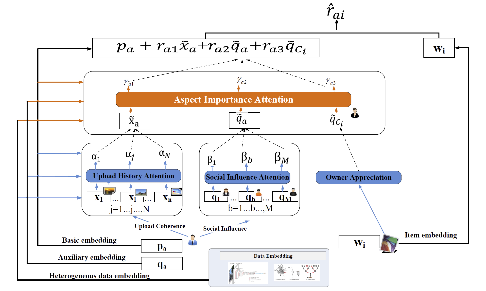

# HASC：A Hierarchical Attention Model for Social Contextual Image Recommendation

 
We develop a hierarchical attention model for social contextual image recommendation. In addition to basic latent user interest modeling in the popular matrix factorization based recommendation, we identify three key aspects (i.e., upload history, social influence, and owner admiration) that affect each user’s latent preferences, where each aspect summarizes a contextual factor from the complex relationships between users and images. After that, we design a hierarchical attention network that naturally mirrors the hierarchical relationship (elements in each aspects level, and the aspect level) of users’ latent interests with the identified key aspects. 

We provide TensorFlow implementations for HASC model.

**Note**: The current software works well with Tensorflow 0.14+. 

## Prerequisites

- TensorFlow
- Python 2.7
- CPU or NVIDIA GPU + CUDA CuDNN

## Getting Started

### Installation

- Clone this repo:

```bash
git clone https://github.com/newlei/HASC.git
cd HASC
```

### Dataset

- Need :

  > Favor <user,item> matrix,  e.g.:<1,2> denotes that user(id:1) favors item(id:2) 
  >
  > Upload History  <user, upload history item> matrix, e.g.:<1,[7,11,23]> show that user(id:1) uploads some items(id:7,11 and 23)  
  >
  >  Social Neighborhood  <user, follow user> matrix, e.g.:<1,[5,6]> show that user(id:1) follows some users(id:5,6)   
  >
  > Owner Admiration  <item, owner user> matrix, e.g:<7,1> show that items(id:7) is uploaded by user(id:1) 
  >
  > Item Visual Information <item, image visual feature> matrix, e.g:<2,[\*]\*4096> is the image feature of item(id:2) 

- For the data in this paper, please seed mail to me：
  >  Please indicate the required dataset and transmission method in the email.

### Train/test

- Train a model:

```python
#!./HASC
python HASC_model.py
```

## Citation 
If you find this useful for your research, please kindly cite the following two papers
that crawal and analyze the data.

```
@article{HASC2019,
  title={A Hierarchical Attention Model for Social Contextual Image Recommendation},
  author={Le, Wu and Lei, Chen and Richang, Hong and Yanjie, Fu and Xing, Xie and Meng, Wang}
  journal={IEEE Transactions on Knowledge and Data Engineering},
  year={2019}
}


@inproceedings{NUSWIDE09,
  title={NUS-WIDE: a real-world web image database from National University of Singapores},
  author = {Tat{-}Seng Chua and  Jinhui Tang and  Richang Hong and Haojie Li and Zhiping Luo and  Yantao Zheng},
  booktitle={Proceedings of the ACM international conference on image and video retrieval, {CIVR} 2009},
  year={2009}
}
```

Besides, you may find these following works are useful for understanding social recommendation.
```
@article{evolveSNS2017,
  title={Modeling the evolution of users’ preferences and social links in social networking services},
  author={Wu, Le and Ge, Yong and Liu, Qi and Chen, Enhong and Hong, Richang and Du, Junping and Wang, Meng},
  journal={IEEE Transactions on Knowledge and Data Engineering},
  volume={29},
  number={6},
  pages={1240--1253},
  year={2017},
  publisher={IEEE}
}


@inproceedings{arse2018,
  title={Attentive recurrent social recommendation},
  author={Sun, Peijie and Wu, Le and Wang, Meng},
  booktitle={The 41st International ACM SIGIR Conference on Research \& Development in Information Retrieval},
  pages={185--194},
  year={2018},
  organization={ACM}
}


@inproceedings{DiffNet2019,
  title={A Neural Influence Diffusion Model for Social Recommendation},
  author={Wu, Le and Sun, Peijie and  Fu, Yanjie and Hong, Richang and Wang, Xiting and Wang, Meng},
  booktitle={The 42st International ACM SIGIR Conference on Research \& Development in Information Retrieval},
  year={2019},
  organization={ACM}
}
```


## Acknowledgments

We thank LMC lab. for providing GPU and dataset for us.

